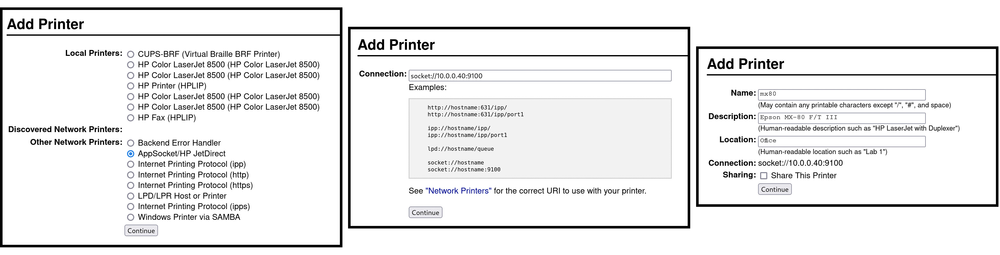
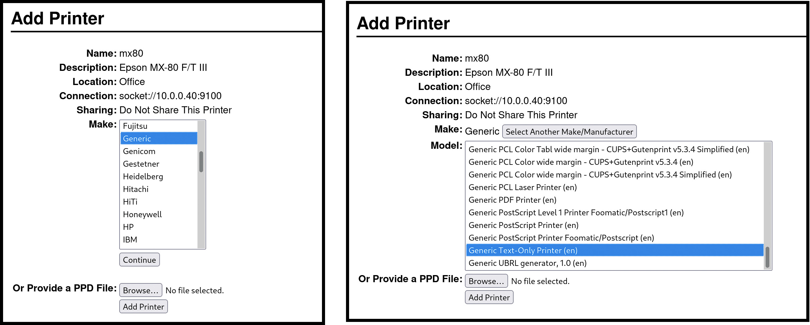
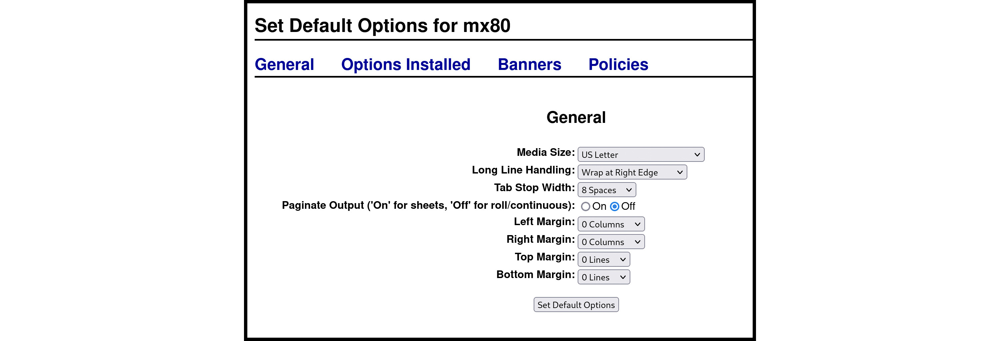

# Linux Config for SmartMatrix

On Linux, setting up a printer server that can write straight to the SmartMatrix over the network is fairly easy. The main work is done via CUPS (Common Unix Printing System) and the `lp` command.

I've successfully done this on several Debian-based machines, although other distros might have their own quirks. That's Linux for you.

Your user account (let's call it `username`) has to be a member of the `lpadmin`. So head to your terminal and type:

```
sudo usermod -aG lpadmin username
```

Then, you head back to the desktop (assuming you’re logged in as `username``) and direct a browser on the server to http://localhost:631 to bring up the CUPS management system.



Select the `Administration` tab and click on `Add a printer`. From the options, select `AppSocket/HP JetDirect`. (Its position in the list seems to vary a lot, so hunt for it.)

Click on `Continue` and you’ll next be prompted to set the connection. You use the protocol `socket://` followed by the IP address of the printer and then the printer's port (by default it's 9100 on the SmartMatrix). In my case, the IP address is 10.0.0.45 so I entered:

```
socket://10.0.0.40:9100
```

When you continue, you’ll be asked to give the printer a name, description and location. The second two are optional and for information purposes only. The name is important, though. You’ll be using this from the command line a lot, so pick something short and appropriate. Let's go with `matrix`.

Now we come to the driver. You could play around with using specific drivers, especially if you want to get graphics out of the printer. For an old dot matrix printer, though, I selected `Generic` at the first stage and `Generic Text-Only Printer (en)` at the second.



Finally, you get to choose some configuration settings. (If you don’t see this screen, go to `Manage Printers`, click on your printer and choose the admin options).

The default seems to be to offset from the left by five characters and also puts space at the top and bottom of the page. But my Epson is hardware configured (via the DIP switches) to use ‘skip over perforation’. You can see the options I chose in the screengrab, but bear in mind many of these are configurable by sending escape sequences to the printer, so you’re not committing yourself here.



All you need do now to print a text file is head to the command line and type:

```
lp <filename> -d matrix
```

(This assumes you named the printer `matrix`)

## Remote configuration

If you want to install the driver on a headless server, there are extra steps. You can’t, by default, reach the CUPS web-based configuration remotely. For security reasons, it’s tied to localhost (127.0.0.1). However, there are options.

The simplest to implement is to SSH in to the server and get comfortable with all the incantations of the `lpadmin` command. And why not? It's good to learn something new.

The second option is to configure CUPS to allow remote admin. Again, you’ll need to SSH into the server and, from the command line, type:

```
sudo cupsctl --remote-admin --remote-any
```

The `--remote-admin` part enables the web interface for remote users and the `--remote-any` allows connections from any IP on your local network.

Then you should restart the CUPS service to ensure the changes take effect:

```
sudo systemctl restart cups
```

At that point you can navigate to the server from any other machine using the server IP and port 631, something like this:

```
http://10.0.20.40:631
```

You’ll almost certainly be prompted at one or more stages for a username and password. Those are the credentials of the user on the server that you added to the `lpadmin` group.

## Taking the tunnel

The final option involves no configuration changes at all. Instead, you fool CUPS into thinking you’re browsing from localhost through the cunning deployment of an SSH tunnel.

On your local machine, drop to the command line and type:

```
ssh -L 6314:localhost:631 username@10.0.20.40
```

(Replace `username` with your account name.)

The `6314` can be any port you want. The IP address at the end needs to be that of the server.

You need to keep the terminal window on your local machine open and then go to the browser and navigate to: `http://localhost:6314`. Your local machine tunnels its traffic to the server while the server itself thinks the traffic is originating from itself.
