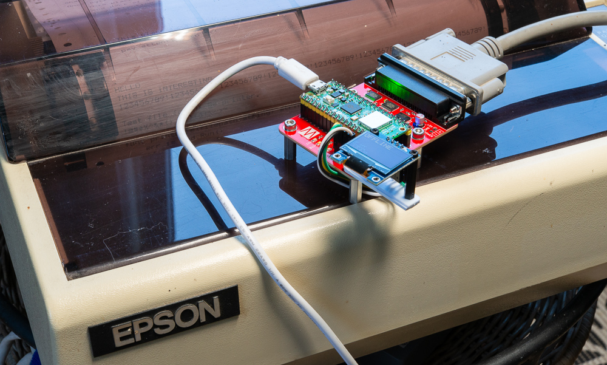

# Setting Up Your SmartMatrix

Let's assume you've ordered a SmartMatrix PCB and have everything soldered in place. Good for you. But it's not going to do very much. There are two key processes you need to undertake: flashing the firmware and configuring the wifi.

## Flashing the firmware

Your still-virgin Raspberry Pi Pico 2W has no code to run until you give it some. My own dev environment for this is VS Code with the Raspberry Pi Pico official extension. This takes care of installing the Pico SDK and makes compiling and flashing a breeze.

If you use a different setup, make sure you have the Pico SDK installed. And you might need to tweak the `CMakeLists.txt` according to your needs.

Other than making any changes for your own preferred dev environment, there's not much you need to do before compiling and flashing. In fact, it should work more or less out of the box.

There are, however, a couple of things you _can_ do, if you choose.

The first is to edit the `lib/wifi_creds.h` file to match the login credentials for your wifi access point. Just change the currently empty strings to something like:

```
#define WIFI_SSID     "mySSID"
#define WIFI_PASSWORD "mySecretPassword"
```

You don't have to do this. You can set the SSID and password at any time via the USB-serial interface.

Another option is to change the port on which the SmartMatrix's socket server listens. By default, this is 9100, which is pretty much standard. It's used, for example, by the HP DirectJet interface. So I'd advise leaving this as it is, unless you have a compelling reason to change it. If that is the case, however, just edit the `lib/defines.h` file to alter the line that currently reads:

```
#define TCP_PORT 9100
```

## Configuring the wifi

If you didn't include your wifi credentials in the config file when you compiled and flashed the firmware, you'll need to do so once the SmartMatrix is running.

You _can_ use the SmartMatrix for printing via the serial port, but it's a bit clunky, is mainly intended for printing from programs and - let's be sensible - it's the wireless connectivity that drew you to this project, right?

Use a standard USB cable to plug the SmartMatrix into your computer. Open up a terminal program, such as Minicom, Coolterm or whatever, select the serial port that has appeared and use the settings:

- Baud rate: 115,200
- Bits: 8
- Parity: None
- Stop bits: 1

This is otherwise known as 115200 8N1.

Reset the SmartMatrix with the reset button on the main PCB. You should see messages appearing.

Type `SSID` followed by <return> and, when prompted, enter the name of your wifi access point, making sure to get any capitalisation correct.

Similarly, type `PASSWD` followed by <return> to enter your password.

Then type `CONN` followed by return. The SmartMatrix should now connect to your wifi.

The credentials are stored (unencrypted) at the top of the non-volatile flash memory, so you need to do this only when connecting to a new network.

The SmartMatrix on my beloved Epson MX-80. The white cable is just powering the board via USB.
