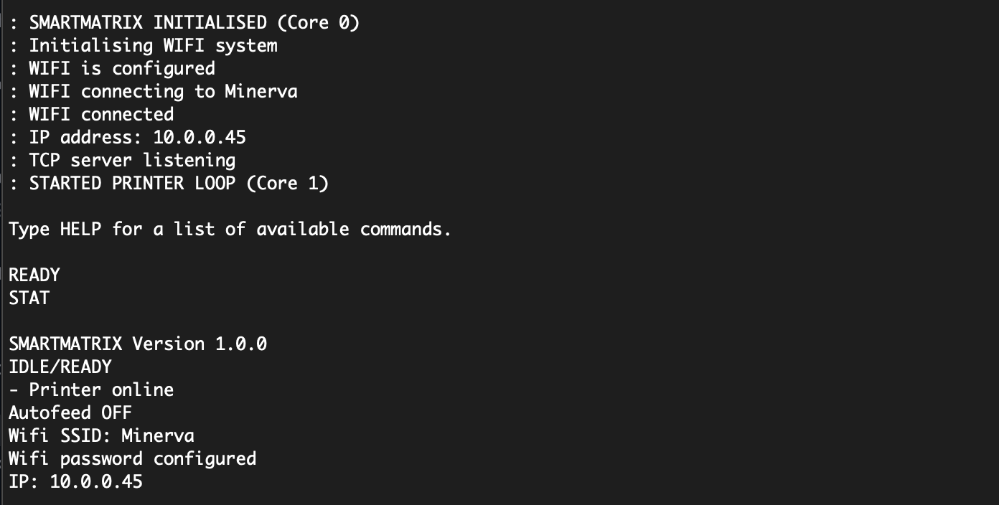

# Using the SmartMatrix

## _{work in progress}_

## Network interface

The Pico connects to your wifi and runs a raw socket server on port :9100 (chosen to be compatible with HP JetDirect devices). Any byte sent to the device's IP address on that port gets sent directly to the printer.

How you send bytes to this interface is up to you. For example, this project includes a simple webserver that acts as a front end for printing files. That uses PHP to send the bytes. And you could do something similar with your own projects - for example, IoT devices logging data on the printer.

And you can print from your laptop or desktop just as with any other printer. You need a printer driver based on the JetDirect protocol and configured to output to the SmartMatrix's IP address. This is very simple to [set up on Linux using lpadmin](https://medium.com/machina-speculatrix/networking-a-dot-matrix-printer-eeda870f5728). Then, from that Linux box, assuming you've named the driver something like 'mx80' and you want to print a file called 'myfile.txt', you enter on the command line:

```
lp myfile.txt -d mx80
```

Your text will appear on the printer as if by magic, transported over the aether by wifi. No wires needed.

It's likely that Windows and MacOS can do something similar. I'll certainly be exploring the latter and will update these notes as I discover how to do it.

## Serial Interface

When you attach the Pico to your computer via a USB cable it presents itself as a serial port. You can use any serial terminal program (such as Minicom, CoolTerm or whatever people do on Windows) to connect to the SmartMatrix with settings of 115200 baud, 8N1.

Boot messages and response to the STAT command over the USB-serial connection.

By default, the SmartMatrix presents a command line interface allowing you to enter commands. Currently we have:

- `HELP` : to get this list of commands.
- `STAT` : to get a printer status report.
- `RESET` : to reset the printer (not the SmartMatrix).
- `SSID` : to configure the SSID setting for the wifi.
- `PASSWD` : to configure the password for the wifi.
- `CONN` : to initiate a wifi connection.
- `AF_ON` : to turn on the Autofeed setting (default is off).
- `AF_OFF` : to turn off the Autofeed setting.
- `PRT` : to enter serial printing mode (see below).

### Serial Printing Mode

If you send the string `PRT` down the serial connection, any further bytes sent to the SmartMatrix over the serial connection will get forwarded directly to the printer until you send an ASCII 0x04 character (End of Transmission, EOT).

This function is mostly meant for use with programs, but you can probably configure your terminal software to send an EOT (I did this using macros in Coolterm). That way you can turn the SmartMatrix into the world's most inconvenient typewriter.

As soon as the SmartMatrix gets the EOT, the serial connection switches back into the normal command line interface mode.
