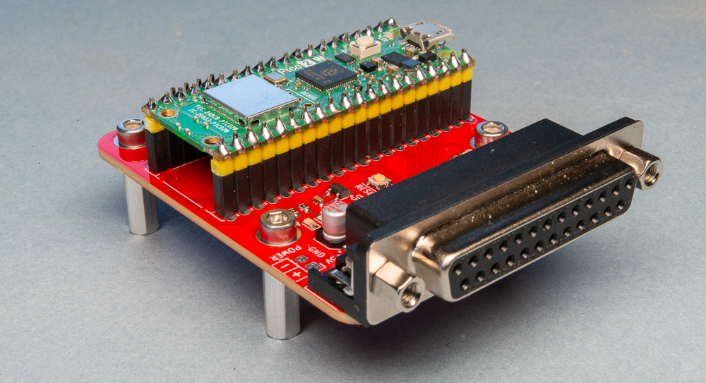
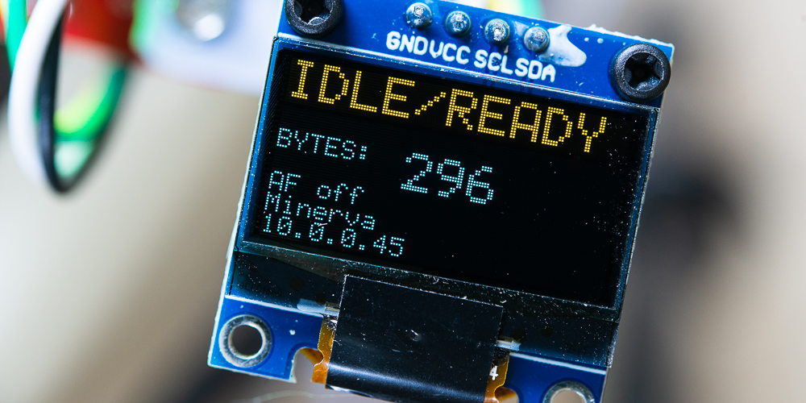
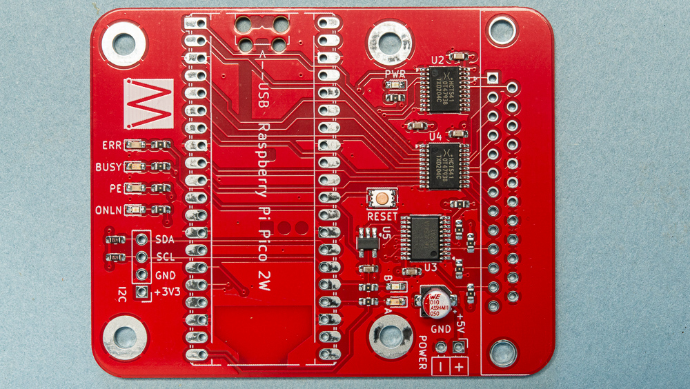

# SMARTMATRIX

Author: Steve Mansfield-Devine (Machina Speculatrix) https://medium.com/machina-speculatrix

Current version: 1.0.1

NB: This software is made available 'as is'. I offer no guarantees, warranties or promises of any kind. Use it for your own pleasure and at your own risk.

This is firmware for the Raspberry Pi Pico 2W-based **SmartMatrix** adapter. This uses the microcontroller to convert serial or network input to parallel output for printing to a dot matrix printer - in my case an Epson MX-80 F/T III.

The SmartMatrix board.

**Network interface**: The Pico connects to your wifi and runs a raw socket server on port :9100 (chosen to be compatible with HP JetDirect devices). Any byte sent to the device's IP address on that port gets sent directly to the printer.

**Serial interface**: Connect the Pico to your computer via a standard USB cable and it appears as a serial interface. With a terminal program such set to 115,200 baud, 8N1, you can enter settings or switch to printing via the serial connection. There's more information in `Docs/Using the SmartMatrix.md`.

An I2C port is used for a small OLED screen (SSD1306).

The 0.96in OLED screen.

## THE HARDWARE

The SmartMatrix hardware device largely consists of the Raspberry Pi Pico 2W, some ICs used as level shifters and buffers/drivers, a 25-pin D-sub socket for the printer cable, a reset  button and a few blinkenlights. It is open source.

Files, including a schematic, Gerbers, placement (Centroid) and a BOM for surface-mount parts, are in the SmartMatrix PCB folder.

You can also download the files from [PCBway's Shared Projects platform](https://www.pcbway.com/project/shareproject/SmartMatrix_networked_parallel_printer_interface_1af07add.html), or order PCBs (with or without the PCB Assembly service) directly from the company.

You will need to add your own Raspberry Pi Pico 2W, a right-angle, female 25-pin D-sub socket, a 128x64 SSD1306 OLED panel and header pins.

The PCB as it comes from PCBway if you use the assembly service.

## WEBSERVER

This project also includes a containerised webserver to act as a front end for printing files. It's in the `webserver` folder, which can be moved anywhere you want it - it doesn't need to stay in the project tree.

## LIFE WITH A DOT MATRIX PRINTER

This project is the culmination of a number of projects all based around making good use of the Epson MX80 F/T-III dot matric printer I bought in the early 1980s and which is still working. I've documented these projects in a number of articles on Machina Speculatrix (Medium subscription required):

- [**Getting to grips with the parallel interface**](https://medium.com/machina-speculatrix/getting-to-grips-with-the-parallel-interface-cfab79c8a7b8) : Putting an old printer back into use meant talking the language of its now (mostly) obsolete interface. 28/02/2025.
- [**Life with a dot matrix printer**](https://medium.com/machina-speculatrix/life-with-a-dot-matrix-printer-ae4d89153b90) : There’s something charming about old technology, especially if you can find a use for it. 05/06/2026.
- [**Networking a dot matrix printer**](https://medium.com/machina-speculatrix/networking-a-dot-matrix-printer-eeda870f5728) : Nothing adds more value to resources like printers than being able to share them. 12/06/2026.
- [**SmartMatrix: A Raspberry Pi Pico parallel printer interface**](https://medium.com/machina-speculatrix/smartmatrix-a-raspberry-pi-pico-parallel-printer-interface-a771d79b1975) : This simple board makes an ancient dot matrix printer available to modern devices across the whole network. 13/08/2026.
- [**A simple OLED driver in C for the Raspberry Pi Pico**](https://medium.com/machina-speculatrix/a-simple-oled-driver-in-c-for-the-raspberry-pi-pico-929d77d9a08a) : OLED panels are cute, crisp and very versatile. And they are surprisingly easy to program yourself, if your aims are modest. 10/09/2026.
- [**SmartMatrix finale: a wifi-enabled parallel printer server with OLED**](https://medium.com/machina-speculatrix/smartmatrix-finale-a-wifi-enabled-parallel-printer-server-with-oled-8383c97e5494) : My odyssey to find the perfect solution for using an old dot matrix printer has finally reached its destination. 18/09/2026.
