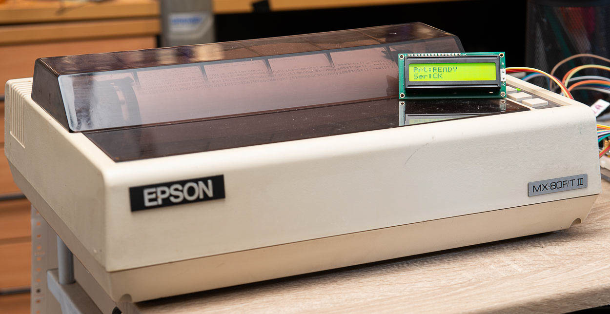

# SMARTMATRIX

This is firmware for the Raspberry Pi Pico 2W-based **SmartMatrix** adapter. This uses the microcontroller to convert serial or network input to parallel output for printing to a dot matrix printer - in my case an Epson MX-80 F/T III.

**Network interface**: The Pico connects to your wifi and runs a socket server on port :9100 (chosen to be compatible with HP JetDirect devices). Any byte sent to the device's IP address on that port gets sent to the printer, no questions asked, no quarter given. All you need on your computer is a printer driver based on the JetDirect protocol and configured to output to the SmartMatrix's IP address. This is very simple to [set up on Linux using lpadmin](https://medium.com/machina-speculatrix/networking-a-dot-matrix-printer-eeda870f5728). Then, from that Linux box, assuming you've named the driver something like 'mx80' and you want to printer a file called 'myfile.txt', you enter on the command line:

```
lp myfile.txt -d mx80
```

Your text will appear on the printer as if by magic, transported over the aether by wifi. No wires needed.

You can also access this interface from any programs you write that want to, say, log data. I have a Go-based program running on my home server that handles printing files and I've written a front end to this on the home intranet server.

**Serial interface**: Connect the Pico to your computer via a standard USB cable and it appears as a serial interface. If you fire up a terminal program such as Minicom, Coolterm or whatever people suffering under Windows use, and set it to 115,200 baud, 8N1, you'll find yourself talking to the command line interface (CLI) of the SmartMatrix. There's more information below.

An I2C port is used for a small OLED screen (SSD1306).

## SERIAL PORT

When you attach the Pico to your computer via a USB cable it presents itself as a serial port. You can use any serial terminal program (such as Minicom, CoolTerm or whatever people do on Windows) to connect to the SmartMatrix with settings of 115200 baud, 8N1.

Via this terminal, you can issue a number of commands. Currently we have:

- `HELP` : to get this list of commands.
- `STAT` : to get a printer status report.
- `RESET` : to reset the printer (not the SmartMatrix).
- `SSID` : to configure the SSID setting for the wifi.
- `PASSWD` : to configure the password for the wifi.
- `CONN` : to initiate a wifi connection.
- `AF_ON` : to turn on the Autofeed setting (the default is off).
- `AF_OFF` : to turn off the Autofeed setting.
- `PRT` : to enter serial printing mode (see below).

### Serial Printing Mode

If you send the string `PRT` down the serial connection, any further bytes sent to the SmartMatrix over the serial connection will get forwarded directly to the printer until you send an ASCII 0x04 character (End of Transmission, EOT).

This function is mostly meant for use with programs, but you can probably configure your terminal software to send an EOT (I did this using macros in Coolterm).

As soon as the SmartMatrix gets the EOT, the serial connection switches back into the normal command line interface mode.

## WIFI CONFIG

The SmartMatrix needs your wifi credentials. It stores these (unencrypted) at the top of flash memory so that they are available even after rebooting or re-powering the device.

You have two ways of configuring the device.

**Edit the `lib/wifi_creds.h` file**: By default, this has empty strings for the SSID and password settings. Enter your credentials here (paying attention to capitalisation and keeping the quote marks) and your configuration will be written automatically to the SmartMatrix when you compile and flash the program.

The contents of the file will look something like this:

```
#define WIFI_SSID     "my_SSID"
#define WIFI_PASSWORD "my_password"
```

**Enter the credentials via the serial interface**: There is a command like interface available over serial, through the USB port on the Pico (see above).

From this interface type the following commands:

`SSID` to set the SSID (not complicated, is it?).

`PASSWD` to enter the password.

`CONN` to get the Pico to connected to your wifi.

The credentials are stored in non-volatile memory, so you need to do this only when connecting to a different network.

## THE HARDWARE

The SmartMatrix hardware device largely consists of the Raspberry Pi Pico 2W, some ICs used as level shifters and buffers/drivers, a 25-pin D-sub socket for the printer cable, a reset  button and a few blinkenlights. It is open source. Files, including a schematic, Gerbers, placement (Centroid) and a BOM for surface-mount parts, are in the SmartMatrix PCB folder.

### OLED

| Line | Function    |
|:----:| ----------- |
| 0, 1 | State       |
| 2    |             |
| 3    | Bytes: num  |
| 4    |        num  |
| 5    | AF setting  |
| 6    | SSID        |
| 7    | IP address  |

My Epson MX-80 and an earlier interface project.

### Signals

| **Pin** | **Function** | **Host** | **Def** | **Cntl by** | **Note** |
| :---: | :---: | :---: | :---: | :---: | --- |
| 1 | /STROBE | Out —> | HIGH | Host | Pulsed low by host for 0.5-500 µsecs |
| 2-9 | Data D0-D7 | Out —> | – | Host | Data bus |
| 10 | /ACK | <— In | HIGH | Printer | Pulsed low by printer to acknowledge receipt of data |
| 11 | BUSY | <— In | LOW | Printer | Taken high by printer when busy |
| 12 | PE | <— In | LOW | Printer | Taken high by printer if paper out |
| 13 | SELECT | <— In | HIGH | Printer | Taken low when printer goes offline |
| 14 | /AUTOFEED | Out —> | LOW | Host | Host pulls high to force automatic linefeed |
| 15 | /ERROR | <— In | HIGH | Printer | Taken low to indicate error |
| 16 | /INIT | Out —> | HIGH | Host | Reset. Taken low by host to initialise/reset printer |
| 17 | /SEL-IN | Out —> | LOW | Host | We don't use this |
| 18-25 | GND | – | – | – | – |

On the MX-80, DIP switch 2-3 can be used to 'fix' the `/AUTOFEED` setting. Factory default for the switch is OFF (which is how my printer has it). In effect, this allows the host to control this function.

When `/AUTOFEED` is LOW, the printer will automatically issue a linefeed when it receives a carriage return. The DIP switch setting on the Epson is ORed with the signal on line 14. So if the DIP switch is set to OFF, the line is pulled high and then the host can either allow this to remain high (Autofeed disabled) or take it low (Autofeed enabled). If the DIP switch is set to ON, Autofeed is always disabled.

## VERSION HISTORY

Dates indicate when the dev branch code was merged into main.

### 0.9.1 IN PROGRESS

- Changed serial connection so that it operates by default in CLI/command mode.
- Created CLI commands to configure wifi, make connection etc.
- Added functionality to save wifi credentials to non-volatile memory.
- Moved many functions out to library files.

### 0.9.0 26/08/2026

- Changed function of user LEDs.
  - LED A flashes when data is sent to the printer.
  - LED B now indicates a successful Wifi connection.
- Added OLED functions & 'telemetry' messages via SIO FIFO.

### 0.5.0 19/08/2026

- Fixed an incorrect default signal setting.
- Tested printing over network via socket connection - works a treat.

### 0.1 14/08/2026

- Wifi works. It usually connects on the second attempt.
- Serial via USB works. Why wouldn't it?
- The direct mode of sending bytes over the serial connection and having them print immediately on the printer works.
- Nothing else has been tested.

## LIFE WITH A DOT MATRIX PRINTER

This project is the culmination of a number of projects all based around making good use of the Epson MX80 F/T-III dot matric printer I bought in the early 1980s and which is still working. I've documented these projects in a number of articles on Machina Speculatrix (Medium subscription required):

- [**Getting to grips with the parallel interface**](https://medium.com/machina-speculatrix/getting-to-grips-with-the-parallel-interface-cfab79c8a7b8) : Putting an old printer back into use meant talking the language of its now (mostly) obsolete interface. 28/02/2025.
- [**Life with a dot matrix printer**](https://medium.com/machina-speculatrix/life-with-a-dot-matrix-printer-ae4d89153b90) : There’s something charming about old technology, especially if you can find a use for it. 05/06/2026.
- [**Networking a dot matrix printer**](https://medium.com/machina-speculatrix/networking-a-dot-matrix-printer-eeda870f5728) : Nothing adds more value to resources like printers than being able to share them. 12/06/2026.
- [**SmartMatrix: A Raspberry Pi Pico parallel printer interface**](https://medium.com/machina-speculatrix/smartmatrix-a-raspberry-pi-pico-parallel-printer-interface-a771d79b1975) : This simple board makes an ancient dot matrix printer available to modern devices across the whole network. 13/08/2026.
