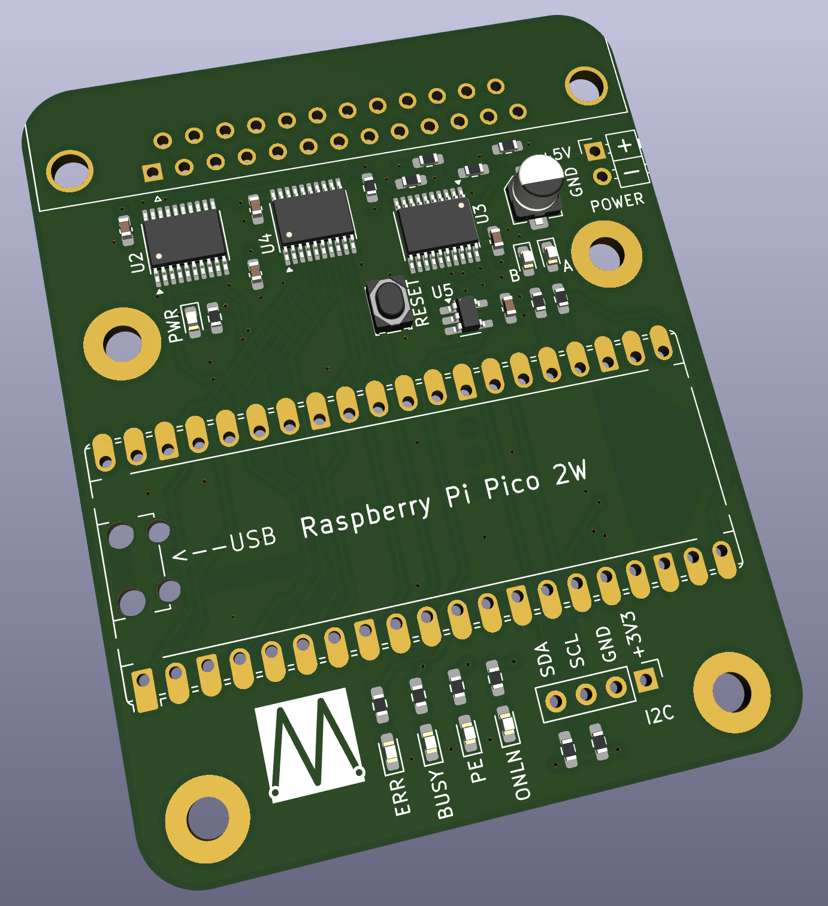

# SmartMatrix PCB

This folder contains the files you'd need to get a copy of the SmartMatrix device fabbed by the PCB manufacturer of your choice (I use [PCBway](https://www.pcbway.com)).

The files are:

- SmartMatrix_B1_Gerbers.zip - the Gerber and drill files.
- SmartMatrix_B1_BOM.xlsx - the bill of materials for the surface-mount parts.
- SmartMatrix_B1_placement.pos - the position/Centroid file.

Plus other useful files:

- SmartMatrix_B1_schematic.pdf - the schematic.
- SmartMatrix_B1_render.png - a render from KiCad.

